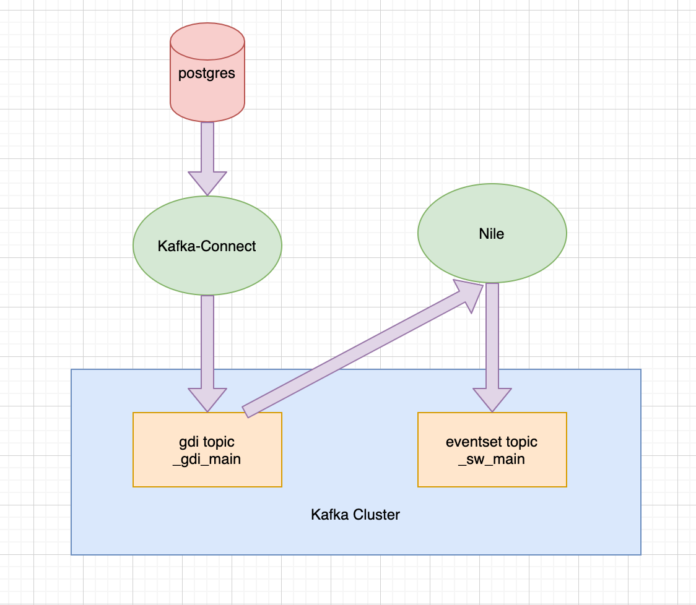

#work #kafka #kafka-connect

## Kafka Connect导入数据到YHP

### 数据流程




### Kafka Connect API

The following are the currently supported REST API endpoints:

- `GET /connectors` - return a list of active connectors
- `POST /connectors` - create a new connector; the request body should be a JSON object containing a string `name` field and an object `config` field with the connector configuration parameters
- `GET /connectors/{name}` - get information about a specific connector
- `GET /connectors/{name}/config` - get the configuration parameters for a specific connector
- `PUT /connectors/{name}/config` - update the configuration parameters for a specific connector
- `GET /connectors/{name}/status` - get current status of the connector, including if it is running, failed, paused, etc., which worker it is assigned to, error information if it has failed, and the state of all its tasks
- `GET /connectors/{name}/tasks` - get a list of tasks currently running for a connector
- `GET /connectors/{name}/tasks/{taskid}/status` - get current status of the task, including if it is running, failed, paused, etc., which worker it is assigned to, and error information if it has failed
- `PUT /connectors/{name}/pause` - pause the connector and its tasks, which stops message processing until the connector is resumed
- `PUT /connectors/{name}/resume` - resume a paused connector (or do nothing if the connector is not paused)
- `POST /connectors/{name}/restart` - restart a connector (typically because it has failed)
- `POST /connectors/{name}/tasks/{taskId}/restart` - restart an individual task (typically because it has failed)
- `DELETE /connectors/{name}` - delete a connector, halting all tasks and deleting its configuration
- `GET /connectors/{name}/topics` - get the set of topics that a specific connector is using since the connector was created or since a request to reset its set of active topics was issued
- `PUT /connectors/{name}/topics/reset` - send a request to empty the set of active topics of a connector

Kafka Connect also provides a REST API for getting information about connector plugins:

- `GET /connector-plugins`- return a list of connector plugins installed in the Kafka Connect cluster. Note that the API only checks for connectors on the worker that handles the request, which means you may see inconsistent results, especially during a rolling upgrade if you add new connector jars
- `PUT /connector-plugins/{connector-type}/config/validate` - validate the provided configuration values against the configuration definition. This API performs per config validation, returns suggested values and error messages during validation.

The following is a supported REST request at the top-level (root) endpoint:

- `GET /`- return basic information about the Kafka Connect cluster such as the version of the Connect worker that serves the REST request (including git commit ID of the source code) and the Kafka cluster ID that is connected to.


### 样例

#### JDBC Source

文档：https://docs.confluent.io/kafka-connect-jdbc/current/source-connector/source_config_options.html#jdbc-source-configs

POST /connectors

```json
{
    "name": "jdbc-sample-1",
    "config": {
        "connector.class": "com.yanhuangdata.parana.connect.jdbc.JdbcSourceConnector",
        "connection.url": "jdbc:postgresql://172.16.0.130:5432/yanhuang",
        "connection.user": "postgresadmin",
        "connection.password": "admin123",
        "mode": "incrementing",
        "table.whitelist": "test_result",
        "incrementing.column.name": "id",
        "tasks.max": 1,
        "poll.interval.ms": 5000,
        "transforms": "setupYHP",
        "transforms.setupYHP.type": "com.yanhuangdata.parana.connect.smt.SetYhpAttribute",
        "transforms.setupYHP.datatype": "json",
        "transforms.setupYHP.eventset": "test",
        "transforms.setupYHP.host": "test_host",
        "value.converter": "org.apache.kafka.connect.json.JsonConverter",
        "value.converter.schemas.enable": "false",
        "errors.tolerance": "all",
        "errors.log.enable": true
    }
}
```


### Kafka Mirror Source

文档：https://github.com/Comcast/MirrorTool-for-Kafka-Connect

POST /connectors

```json
{
    "name": "kafka-example-1",
    "config": {
        "connector.class": "com.comcast.kafka.connect.kafka.KafkaSourceConnector",                
        "source.bootstrap.servers": "kafka-dev.kafka.svc.cluster.local:9092",
        "source.topic.whitelist": "connect-.*",
        "source.auto.offset.reset": "earliest",
        "source.group.id": "kafka-connect-1",
        "connector.consumer.reconnect.backoff.max.ms": "10000",
        "tasks.max": "2",
        "key.converter": "org.apache.kafka.connect.converters.ByteArrayConverter",
        "value.converter": "org.apache.kafka.connect.converters.ByteArrayConverter",
        "transforms": "setupYHP",
        "transforms.setupYHP.type": "com.yanhuangdata.parana.connect.smt.SetYhpAttribute",
        "transforms.setupYHP.datatype": "plain_text",
        "transforms.setupYHP.eventset": "test2",
        "transforms.setupYHP.host": "kafka-dev.kafka.svc.cluster.local"
    }
}
```


